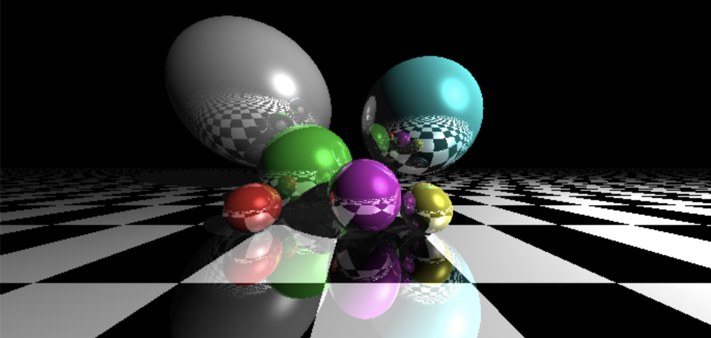

# Computer Graphics Ray Tracing

Coursework for COMP60005 Graphics, from Department of Computing, Imperial College London

### Simple Geometry Ray Tracing Implementation using Render-to-Texture Vertex and Fragment Shaders

It is implemented on the [Computer Graphics Shader Lab Framework](https://shaderlabweb.doc.ic.ac.uk/). 

Example result: 

